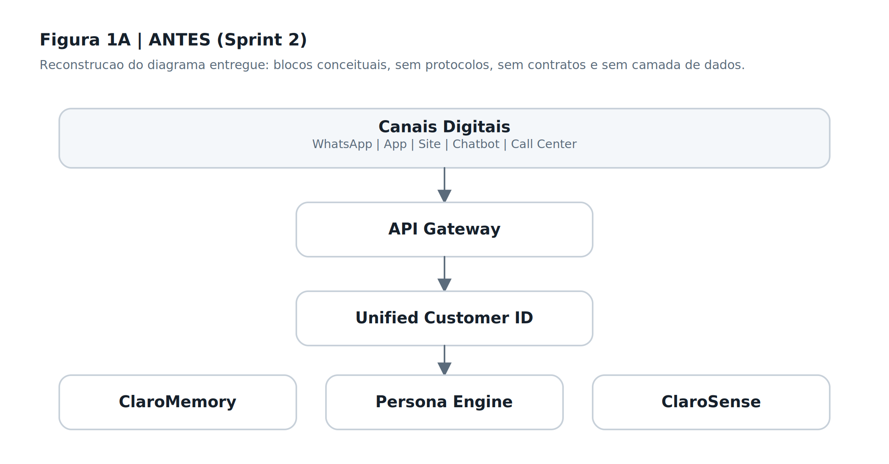
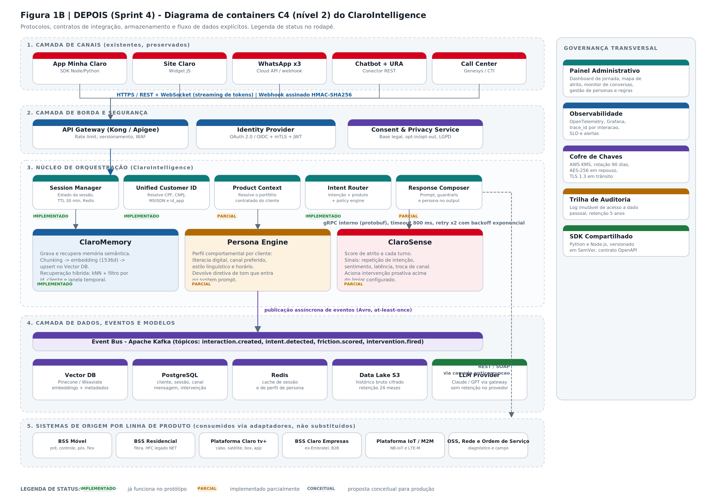
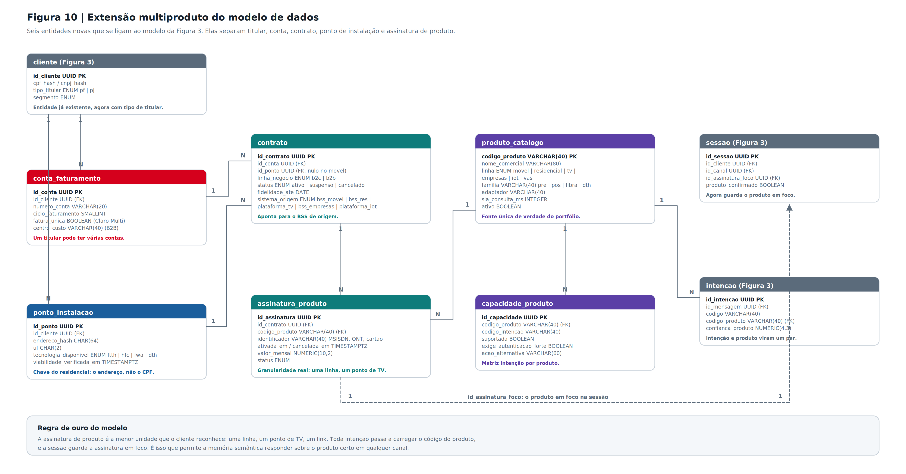
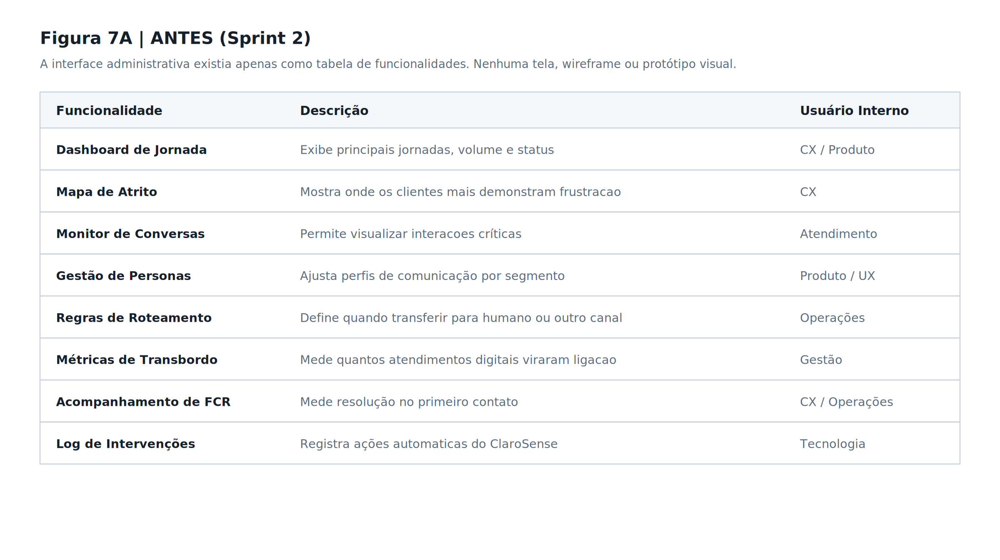
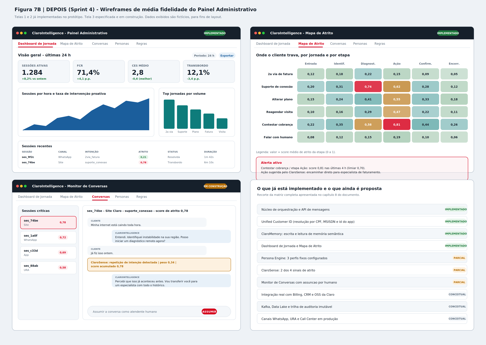
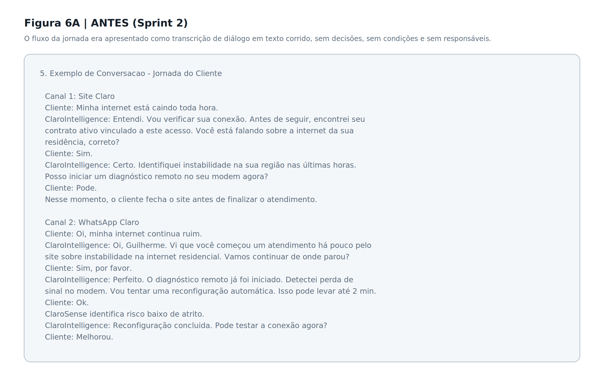
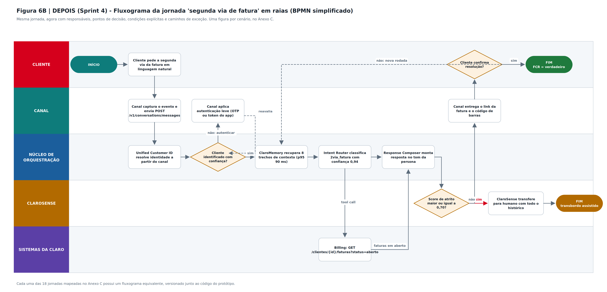

# Arquitetura

O ClaroIntelligence é uma **camada de orquestração com IA sobre os canais digitais já existentes da
Claro** — ele não substitui site, app ou WhatsApp, ele coordena o que acontece por trás deles. O
projeto nasce de um problema concreto: hoje esses canais têm inteligências isoladas, então o cliente
repete a mesma informação toda vez que troca de canal, o transbordo para atendente humano cresce, e
cada time reconstrói integrações parecidas contra os sistemas de back-office (BSS).

## Visão geral (antes / depois)

| Antes | Depois |
|---|---|
|  |  |

Sem uma camada de orquestração, cada canal fala diretamente com os sistemas de origem e não sabe o
que aconteceu nos outros. Com o ClaroIntelligence no meio, todo canal passa por um núcleo único que
resolve *quem é o cliente*, *qual produto ele quer dizer*, *o que já foi dito antes* e *se ele pode
receber aquele dado* — antes de qualquer resposta.

## As 5 camadas

```
┌─────────────────────────────────────────────────────────────────┐
│ 1. CANAIS      Site · App · WhatsApp · Call Center               │
├─────────────────────────────────────────────────────────────────┤
│ 2. BORDA       CORS · rate limit · guardrails · 2FA · protocolo  │
├─────────────────────────────────────────────────────────────────┤
│ 3. NÚCLEO      Intent Router · Product Context Resolver          │
├─────────────────────────────────────────────────────────────────┤
│ 4. MOTORES     ClaroMemory · Persona Engine · ClaroSense         │
├─────────────────────────────────────────────────────────────────┤
│ 5. DADOS       SQLite · adaptadores por linha de produto         │
└─────────────────────────────────────────────────────────────────┘
       ↘ Fila de atendimento humano (Console do Atendente)
```

| Camada | Componente | Onde está |
|---|---|---|
| Canais | Simulação de site / app / WhatsApp | [`pages/ChatCliente.jsx`](../clarointelligence/src/pages/ChatCliente.jsx) |
| Borda | CORS, rate limit, ponto de entrada único | [`server.js`](../clarointelligence-api/src/server.js) |
| Borda | Guardrails da IA | [`services/guardrails.js`](../clarointelligence-api/src/services/guardrails.js) |
| Borda | Verificação em duas etapas | [`services/verificacao.js`](../clarointelligence-api/src/services/verificacao.js) |
| Borda | Protocolo de atendimento | [`services/protocolo.js`](../clarointelligence-api/src/services/protocolo.js) |
| Núcleo | Detecção de intenção | [`services/intentDetector.js`](../clarointelligence-api/src/services/intentDetector.js) |
| Núcleo | Resolução de produto + matriz de capacidades | [`services/productResolver.js`](../clarointelligence-api/src/services/productResolver.js) |
| Motores | Memória, persona, atrito | [`claroMemory.js`](../clarointelligence-api/src/services/claroMemory.js) · [`personaEngine.js`](../clarointelligence-api/src/services/personaEngine.js) · [`claroSense.js`](../clarointelligence-api/src/services/claroSense.js) |
| Ação | Autoatendimento transacional | [`services/autoatendimento.js`](../clarointelligence-api/src/services/autoatendimento.js) |
| Ação | Fila de atendimento humano | [`services/fila.js`](../clarointelligence-api/src/services/fila.js) |
| Dados | Banco + adaptadores | [`database.js`](../clarointelligence-api/src/database.js) · [`adapters/`](../clarointelligence-api/src/adapters/) |

### Regras de arquitetura

- **Segurança antes do processamento.** Guardrails classificam a mensagem antes de qualquer outra
  coisa. Ataque não chega ao resolver, ao adaptador nem ao LLM.
- **Caminho crítico separado do caminho de aprendizado.** A resposta é síncrona; a gravação da
  memória é assíncrona (`setImmediate`) e nunca atrasa o cliente.
- **Camada anticorrupção diante dos BSS.** O núcleo nunca conhece o formato de um sistema de origem.
  Cada linha de produto tem seu adaptador, traduzindo para um contrato interno único.
- **Provedor de LLM plugável.** A geração passa por um único módulo (`services/llm.js`). Trocar por
  um provedor real não toca no núcleo.
- **Ponto de entrada único.** Todo canal chama `POST /api/chat/mensagem`; o canal é um parâmetro,
  não uma rota. É o que torna a integração real com WhatsApp uma questão de adaptador de transporte
  — ver [INTEGRACAO_WHATSAPP.md](INTEGRACAO_WHATSAPP.md).

## Pipeline de uma mensagem

Fluxo real de `POST /api/chat/mensagem`, em [`routes/chat.js`](../clarointelligence-api/src/routes/chat.js):

```
Cliente envia mensagem
        │
        ▼
 1. Carrega cliente e sessão (cria se não existir)
        │
        ▼
 2. GUARDRAILS ─────────────── é ataque? → bloqueia e ENCERRA aqui
        │                       (não toca em resolver, adaptador ou LLM)
        ▼
 3. Em atendimento humano? ─── sim → roteia para a fila, a IA sai do caminho
        │
        ▼
 4. Detecta intenção
        │
        ▼
 5. Verificação 2FA pendente? ─ é um código? → valida e RETOMA a intenção original
        │                       não? → repete o pedido do código
        ▼
 6. Abre/recupera o PROTOCOLO (todo contato gera um)
        │
        ▼
 7. Canal WhatsApp e sessão não identificada?
        │                    → envia código por SMS e ENCERRA o turno
        │                      (nada do contrato sai antes da confirmação)
        ▼
 8. Consulta de protocolo? ──── sim → valida titularidade e devolve a linha do tempo
        │
        ▼
 9. Proposta pendente + confirmação? → EXECUTA a ação e FECHA o protocolo
        │
        ▼
10. PRODUCT CONTEXT RESOLVER (cascata de 7 etapas — ver abaixo)
        │                       ambíguo? → pergunta e encerra o turno
        ▼
11. ClaroMemory (contexto) + Persona Engine (tom) + Adaptador (dados do BSS)
        │
        ▼
12. Autoatendimento: propõe pagamento ou upgrade, se aplicável
        │
        ▼
13. LLM simulado gera a resposta → sanitização de saída
        │                       (aviso de retomada de protocolo entra aqui,
        │                        só se a sessão estiver identificada e ainda
        │                        não tiver sido avisada)
        ▼
14. ClaroSense recalcula score de atrito e risco de churn
        │                       score ≥ 80 ou pediu humano? → entra na FILA
        ▼
15. Persiste mensagens, sinais e intervenções
        │
        ▼
16. [assíncrono] ClaroMemory grava o resumo
```

**Por que o 2FA está no passo 7 e não perto do fim:** identificação é condição de entrada, não
consequência da intenção. Se o desafio só disparasse ao encostar num dado sensível, a conversa já
teria devolvido portfólio e histórico de outros canais para alguém não identificado. Encerrar o
turno ali garante que nada do contrato — inclusive o protocolo em aberto no call center — sai antes
da confirmação.

O diagrama de fluxo de dados está em [`assets/diagramas/fluxo_dados.png`](assets/diagramas/fluxo_dados.png).

## Protocolo de atendimento

**Base regulatória:** a Anatel exige que a prestadora protocole toda demanda do consumidor e permita
recuperar o histórico por esse número — Regulamento Geral de Direitos do Consumidor, **Resolução
765/2023** (que revogou a 632/2014).

Formato: `AAAAMMDD` + sequencial de 6 dígitos (`20260915000042`), exibido como `2026.0915.000042`.

O protocolo é **o que costura a jornada entre canais**. Além do ClaroMemory (que recupera resumos
por cliente), o protocolo dá uma âncora explícita e verificável: o cliente que abriu um chamado no
call center e voltou pelo chat é reconhecido pelo **mesmo número**, com a linha do tempo completa
do que já aconteceu.

```
Roberto liga no call center (1052)          →  protocolo 2026.0915.000002 aberto
  contesta cobrança de R$ 34,90                 estorno encaminhado, sem confirmação
  chamada encerrada sem resolução               status: ABERTO

        ... 3 horas depois ...

Roberto abre o chat do app                   →  sistema localiza o protocolo em aberto
  "eae, e aquele estorno que vcs iam fazer?"     em OUTRO canal e retoma do ponto exato:

  📋 "Localizei seu protocolo 2026.0915.000002, aberto há 3h no Call Center (1052)
      sobre 'Cobrança divergente na fatura' e ainda em aberto.
      Vou continuar deste ponto — você não precisa explicar de novo."
```

Cada passo relevante grava um evento em `protocolo_eventos` (abertura, verificação, desambiguação,
transferência, encerramento), formando uma trilha auditável da jornada inteira.

O protocolo também registra **quem resolveu**: `autoatendimento` ou `atendente_humano`. É disso que
sai a **taxa de contenção** — o indicador de negócio que mostra quanto do atendimento se resolveu
sem custo de pessoa.

## Product Context Resolver

O mesmo titular pode ter fibra, linhas móveis, TV e contratos corporativos ao mesmo tempo. "Minha
internet caiu" pode ser a fibra da casa, o FWA 5G, a franquia do celular ou o link dedicado da
empresa. Errar o produto é pior que não responder, porque executa a ação certa no contrato errado.



Cascata, do sinal mais forte para o mais fraco:

| # | Etapa | Exemplo |
|---|---|---|
| 1 | Produto já confirmado na sessão | não se pergunta duas vezes |
| 2 | Portfólio com um único produto | Ana só tem fibra — resolve direto |
| 3 | Menção explícita no texto | "do celular" → linha móvel |
| 4 | Afinidade intenção → linha | `recarga` só existe em móvel |
| 5 | **Matriz de capacidades** | `franquia` descarta o link dedicado, que não tem franquia |
| 6 | Afinidade canal → linha | desempate final |
| 7 | Pergunta ao cliente | só aqui, e em uma frase só |

A **matriz de capacidades** (etapa 5) é o que evita perguntar quando o portfólio já responde
sozinho. A Vega Soluções tem dois contratos na linha `empresas`; ao perguntar sobre franquia
compartilhada, o link dedicado é descartado automaticamente e o plano móvel corporativo é
resolvido **sem nenhuma pergunta**. A matriz completa está em [PRODUTOS.md](PRODUTOS.md#matriz-de-capacidades).

Quando a ambiguidade é **dentro da mesma linha** (dois celulares, duas casas), a pergunta mostra o
identificador real de cada contrato — número da linha, endereço, nome do dependente — e não apenas
o nome do plano.

**Chaves de identificação por linha:**

| Linha | Chave real |
|---|---|
| Móvel | MSISDN, sob uma conta de faturamento |
| Banda larga fixa | ponto de instalação (o endereço) — o mesmo CPF com duas casas tem dois contratos |
| TV / streaming | assinatura vinculada ao CPF ou ao ponto |
| Corporativo | CNPJ, com múltiplos contratos por site e centro de custo |

## Motores

### ClaroMemory — continuidade entre canais
Grava um resumo curto de cada interação e recupera os das últimas 24h no início da próxima conversa,
em qualquer canal. Detecta jornada multicanal comparando o canal atual com o da última sessão
encerrada. Trabalha em conjunto com o protocolo: a memória dá o *contexto*, o protocolo dá a
*âncora formal*.

### Persona Engine — adaptação de tom
Classifica em **quatro perfis**: `digital`, `intermediario`, `assistido` e `informal`.

A quarta persona foi acrescentada porque tratar gíria e abreviação como ruído produz respostas frias
com quem simplesmente escreve como fala. Informalidade é registro linguístico, não falta de
competência — e o cliente informal recebe tom espelhado, não um formulário.

A classificação usa um **dicionário léxico editável pelo painel** (tabela `persona_dicionario`), não
regex fixa no código: a equipe de atendimento cadastra uma gíria nova sem deploy. Cada termo soma
peso para uma persona; a de maior pontuação define o tom. O painel mostra **quais termos** pesaram
na decisão.

Há uma regra de *blending* que evita trocar de perfil por uma única mensagem: quem é `assistido` e
usa um termo técnico passa por `intermediario`, não vira `digital` de imediato. Já a informalidade é
aceita sobre qualquer perfil, exceto sobre `assistido` — quem precisa de apoio continua precisando,
mesmo escrevendo "blz".

### ClaroSense — atrito e risco de cancelamento

Sete sinais, cada um com peso fixo e explicação legível:

| Sinal | Peso | Por quê |
|---|---|---|
| Tom agressivo | +35 | Xingamento, caixa alta sustentada ou ameaça de Procon/Anatel — estágio mais avançado do atrito |
| Pedido de atendente humano | +35 | O cliente desistiu do autoatendimento |
| Menção a cancelamento | +30 | Verbalizou cancelar ou migrar para a concorrência |
| Linguagem de frustração | +28 | "absurdo", "já tentei", "cansado" — o problema vinha de antes |
| Repetição de intenção | +22 | Pediu a mesma coisa de novo: a resposta anterior não resolveu |
| Recontato em outro canal | +15 | O problema atravessou canais sem solução |
| Resposta monossilábica | +10 | Impaciência ou desengajamento |

O score **acumula ao longo da sessão** — repetir o problema e escalar o tom são exatamente os
comportamentos que levam ao cancelamento, e a régua reflete essa escalada. Níveis: alerta (40+),
risco (65+), transbordo (80+).

O **risco de churn** traduz o atrito em probabilidade de cancelamento: parte de 70% do score e
soma agravantes (menção a cancelamento +25, agressividade +15, recontato +10, repetição +8,
conversa longa +8), resultando em `baixo` / `moderado` / `alto` / `critico`, cada um com ação de
retenção recomendada.

A régua é determinística e auditável de propósito: ninguém precisa confiar numa caixa-preta para
entender por que um cliente foi transferido. O painel do ClaroSense mostra a escalada turno a turno.

## Fila de atendimento humano

O transbordo deixou de ser uma mensagem ("vou te transferir") e virou **estado observável**.

Quando o ClaroSense atinge o transbordo — ou o cliente pede um atendente — a sessão entra em
`fila_atendimento` com prioridade (alta/média/baixa), posição e tempo estimado. Do outro lado, o
**Console do Atendente** ([`ConsoleAtendente.jsx`](../clarointelligence/src/pages/ConsoleAtendente.jsx))
mostra a fila ordenada por prioridade e, ao abrir um caso, entrega o briefing completo antes da
primeira palavra: protocolo com linha do tempo, sinais de atrito que causaram o transbordo, risco de
churn, portfólio e as últimas falas do cliente.

Uma pessoa real assume e digita; a mensagem aparece no chat do cliente em tempo real. Enquanto o
atendimento humano está ativo, **a IA sai do caminho**: as mensagens do cliente vão direto para a
conversa, sem passar pelo pipeline. Ao encerrar, o protocolo fecha marcado como resolvido por
`atendente_humano`.

O cliente não repete nada — que é a promessa inteira do produto, agora demonstrável de ponta a
ponta.

## Autoatendimento transacional

O contraponto necessário ao transbordo: a maior parte da demonstração mostra o sistema detectando
atrito e chamando um humano, mas o ganho real está no oposto — a conversa que se resolve inteira no
chat.

Dois fluxos completos, em duas etapas (proposta → confirmação):

- **Pagamento** — mostra a fatura, gera PIX copia-e-cola com autenticação, fecha o protocolo.
- **Upgrade de plano** — compara o plano atual com o próximo degrau da escada de fibra
  (350 → 500 → 600 → 1 Giga → 5 Giga → 10 Giga), ativa e **altera o contrato no banco de verdade**.

A proposta fica persistida com status `proposta`; o "sim" do cliente no turno seguinte a encontra e
executa. É isso que permite responder a um simples "pode ser" sem perder o que estava em curso.

Ao final, o protocolo é encerrado com `resolvido_por: autoatendimento` — e é daí que sai a taxa de
contenção do painel.

## Camadas do front-end

Um front-end único simula os 3 canais trocando o parâmetro `canal` e o estilo visual — a lógica de
negócio inteira vive no backend. Oito telas:

| Tela | Função |
|---|---|
| Dashboard | KPIs e séries históricas |
| Mapa de Atrito | Heatmap por jornada |
| **Monitor de Conversas** | Busca e filtros para volume de operação (canal, status, produto, persona, faixa de atrito, data, faixa de horário, protocolo), com paginação e contadores por faceta |
| **Log do ClaroSense** | Régua de pesos, simulação da escalada, clientes em risco de churn e log de sinais |
| **Gestão de Personas** | 4 personas, dicionário léxico editável e classificador ao vivo |
| **Chat do Cliente** | Demo dos 3 canais com painel de transparência da IA |
| **Console do Atendente** | Fila e atendimento humano ao vivo |
| Perfis de Usuário | RBAC simulado |

## Fora de escopo do MVP (declarado)

- Autenticação/autorização reais — ver [SEGURANCA.md](SEGURANCA.md).
- Integração real com WhatsApp — análise de viabilidade em [INTEGRACAO_WHATSAPP.md](INTEGRACAO_WHATSAPP.md).
- Postgres com extensão vetorial para memória semântica real (o MVP usa consulta relacional por
  cliente + janela de tempo, não busca por similaridade) — ver [DECISOES.md](DECISOES.md).
- Provedor de LLM real — hoje é simulador determinístico, sem custo, latência ou API key.
- Adaptadores de IoT e envio real de SMS para o segundo fator.

## Wireframes e fluxogramas

| Antes | Depois |
|---|---|
|  |  |
|  |  |

## Para aprofundar

- [PRODUTOS.md](PRODUTOS.md) — catálogo real da Claro e matriz de capacidades
- [BANCO_DE_DADOS.md](BANCO_DE_DADOS.md) — esquema completo
- [API.md](API.md) — todos os endpoints
- [SEGURANCA.md](SEGURANCA.md) — guardrails, 2FA, LGPD e limitações
- [INTEGRACAO_WHATSAPP.md](INTEGRACAO_WHATSAPP.md) — viabilidade da integração real
- [DECISOES.md](DECISOES.md) — por que cada escolha técnica foi tomada
