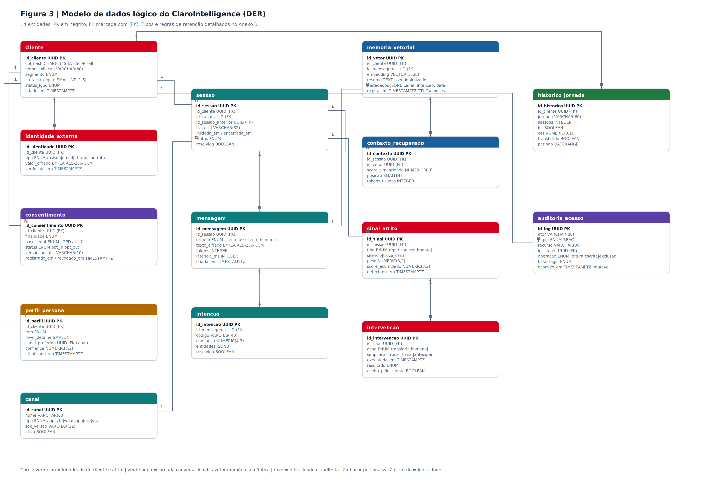

# Banco de dados

O MVP usa **SQLite** através do módulo nativo `node:sqlite` (`DatabaseSync`), embutido no próprio Node.js — sem instalar servidor de banco, sem Docker, sem drivers nativos compilados. Veja o porquê dessa escolha em [DECISOES.md](DECISOES.md).

- Arquivo: `clarointelligence-api/clarointelligence.sqlite` (gerado por `npm run seed`, **não** versionado no git — está no `.gitignore` porque é dado, não código).
- Esquema definido em [`clarointelligence-api/src/database.js`](../clarointelligence-api/src/database.js), criado automaticamente na primeira conexão (`CREATE TABLE IF NOT EXISTS`).
- Dados de demonstração (catálogo de produtos, 6 clientes, contratos) inseridos por [`clarointelligence-api/src/seed.js`](../clarointelligence-api/src/seed.js).

## Diagrama do modelo de dados

## Tabelas

### `clientes`
Cadastro do titular. Note que **o CPF nunca é armazenado em texto puro** — só uma versão já mascarada (`cpf_mascara`, ex: `***.***.456-**`). Isso é uma decisão de minimização de dados desde a origem, não uma máscara aplicada na exibição — ver [SEGURANCA.md](SEGURANCA.md#lgpd-e-dados-pessoais).

| Coluna | Tipo | Descrição |
|---|---|---|
| `id` | TEXT (PK) | ex: `cli-ana-souza` |
| `nome` | TEXT | |
| `email` | TEXT | |
| `telefone` | TEXT | |
| `cpf_mascara` | TEXT | já armazenado mascarado, nunca em texto puro |
| `perfil_persona` | TEXT | `digital` \| `intermediario` \| `assistido` |
| `created_at` | TEXT | |

### `produtos_catalogo`
Fonte única de verdade do que a Claro oferece. Um produto novo entra por dado (seed/painel), nunca por alteração de código no núcleo.

| Coluna | Tipo | Descrição |
|---|---|---|
| `codigo` | TEXT (PK) | estável e independente do nome comercial, ex: `RES-FIB-300` |
| `nome` | TEXT | nome comercial, ex: "Claro Fibra 300 Mega" |
| `linha` | TEXT | `movel` \| `residencial` \| `tv` |
| `familia` | TEXT | ex: `fibra`, `pos-pago`, `combo` |
| `descricao` | TEXT | |
| `ativo` | INTEGER | soft-delete de catálogo |

### `contratos`
Vínculo entre cliente e produto — é aqui que mora o "portfólio" que o Product Context Resolver consulta.

| Coluna | Tipo | Descrição |
|---|---|---|
| `id` | TEXT (PK) | |
| `cliente_id` | TEXT (FK → `clientes.id`) | |
| `produto_codigo` | TEXT (FK → `produtos_catalogo.codigo`) | |
| `linha` | TEXT | redundante com o produto, otimiza filtro por linha nos adaptadores |
| `status` | TEXT | `ativo` é o único status consultado pelo resolver |
| `plano_nome` | TEXT | |
| `valor_mensal` | REAL | |
| `data_inicio` | TEXT | |
| `dados_extra` | TEXT | JSON livre por linha (ex: MSISDN, eSIM) — só o adaptador da linha sabe interpretar |

### `sessoes`
Uma conversa em um canal. Guarda o estado de curto prazo: produto em foco, se já foi confirmado, e o score de atrito acumulado.

| Coluna | Tipo | Descrição |
|---|---|---|
| `id` | TEXT (PK) | |
| `cliente_id` | TEXT (FK) | |
| `canal` | TEXT | `site` \| `app` \| `whatsapp` \| `callcenter` |
| `produto_codigo_foco` | TEXT | produto resolvido para esta sessão |
| `produto_confirmado` | INTEGER | trava a resolução após a 1ª confirmação, evita reperguntar |
| `score_atrito` | REAL | 0–100, acumulado turno a turno |
| `status` | TEXT | `ativa` \| `transferida` \| `encerrada` |
| `trace_id` | TEXT | id de rastreio, devolvido em toda resposta da API |

### `mensagens`
Histórico turno a turno (cliente e sistema), com os metadados de decisão de cada turno — intenção detectada, confiança, produto resolvido, score de atrito e quais memórias foram usadas para gerar a resposta.

| Coluna | Tipo | Descrição |
|---|---|---|
| `id` | TEXT (PK) | |
| `sessao_id` | TEXT (FK) | |
| `papel` | TEXT | `cliente` \| `sistema` |
| `conteudo` | TEXT | |
| `intencao_codigo` | TEXT | |
| `confianca_intencao` | REAL | 0–1 |
| `produto_codigo` | TEXT | |
| `score_atrito_turno` | REAL | |
| `sinais_atrito` | TEXT | JSON dos sinais detectados neste turno |
| `memoria_usada` | TEXT | JSON dos ids de `memoria_conversacional` usados na resposta — dá rastreabilidade de por que o sistema "lembrou" algo |

### `sinais_atrito`
Um registro por sinal individual detectado pelo ClaroSense (não só o score agregado) — é o que alimenta a tela "Log ClaroSense" no painel.

| Coluna | Tipo | Descrição |
|---|---|---|
| `tipo` | TEXT | `repeticao_intencao` \| `monossilabico` \| `sentimento_negativo` \| `solicita_humano` |
| `valor` | REAL | pontos somados ao score |

### `intervencoes`
Ações automáticas tomadas em resposta ao nível de atrito.

| Coluna | Tipo | Descrição |
|---|---|---|
| `tipo` | TEXT | `transferencia_humano` \| `simplificacao` \| `antecipacao` |
| `gatilho` | TEXT | condição que disparou, ex: `score_atrito=82 >= 80` |
| `acao` | TEXT | descrição da ação tomada |
| `resultado` | TEXT | `pendente` até ser fechada pelo atendente humano |

### `memoria_conversacional`
O núcleo do ClaroMemory: um resumo curto por interação, recuperável por até 24h em qualquer canal seguinte.

| Coluna | Tipo | Descrição |
|---|---|---|
| `cliente_id` | TEXT (FK) | chave de recuperação — é por cliente, não por sessão |
| `canal` | TEXT | permite detectar jornada multicanal |
| `produto_codigo` | TEXT | permite priorizar memórias do mesmo produto |
| `resumo` | TEXT | texto curto gerado a partir da intenção + primeiros 80 caracteres da mensagem |
| `resolvido` | INTEGER | reservado para fechar pendências (hoje sempre `0` na gravação) |
| `pendencias` | TEXT | JSON, reservado para próximos passos em aberto |

### `personas_config`
Linha única (`id = 1`) com os limiares editáveis pela tela "Gestão de Personas" do painel — permite calibrar sensibilidade sem alterar código.

## Convenções do esquema

- **IDs são UUID v4 em texto**, gerados na aplicação (`uuid` npm package), não `AUTOINCREMENT` — facilita gerar dados de seed determinísticos e evita vazar contagem de linhas.
- **Todo acesso ao banco usa consultas parametrizadas** (`db.prepare(...).run(params)` / `.get(params)` / `.all(params)`), nunca concatenação de string com entrada do usuário — isso elimina a classe de vulnerabilidade de SQL injection por construção. Ver [SEGURANCA.md](SEGURANCA.md).
- **Datas em texto ISO** (`datetime('now')`), sem tipo `DATETIME` nativo — padrão do SQLite.
- **Sem transações explícitas multi-statement** (`node:sqlite` não expõe `.transaction()`): operações compostas usam `db.exec('BEGIN...COMMIT')` ou múltiplos `run()` sequenciais quando necessário. Ver [DECISOES.md](DECISOES.md).
